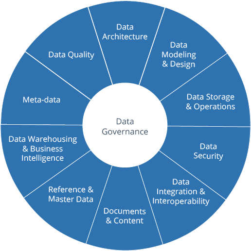

# Data Governance

1. [DAMA](https://www.dama.org/cpages/dmbok-2-image-download)
2. How to build [part 1](https://www.phdata.io/blog/snowflake-data-governance/), [part 2](https://www.phdata.io/blog/snowflake-data-governance-2/)
3. [Definition](https://www.cleverrepublic.com/what-is/data-governance/), taken from DAMA
4. [What is ](https://www.imperva.com/learn/data-security/data-governance/)- by Imperva
5. [a very thorough article](https://bi-survey.com/data-governance) \
   
6. [action items](https://data.wisc.edu/data-governance/)
7. [8 steps to start your data governanace program](https://www.analytics8.com/blog/8-steps-to-start-your-data-governance-program/)
